<!-- hero: monochrome ASCII portrait that types itself in, beside the
     neofetch-style info card whose rows fade in one by one.
     portrait:  python scripts/prep_photo.py <photo> && python scripts/make_ascii_svg.py
     info card: python scripts/make_info_card.py -->

<h3><code>gunjan@github ~ $ whoami</code></h3>

<table>
<tr>
<td valign="top"></td>
<td valign="top"></td>
</tr>
</table>

 
 

<h3><code>gunjan@github ~ $ ./links.sh</code></h3>

<b>AI & Data Science · Data Analytics · Python · SQL · Power BI</b>

 

 

